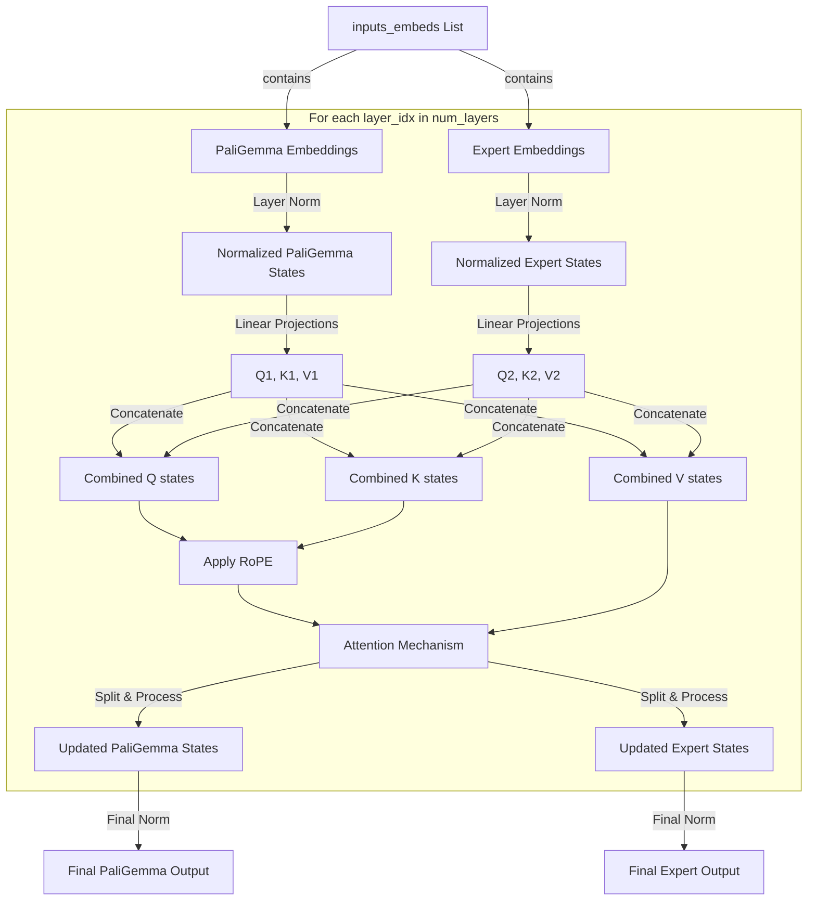

# Architecture Diagram 

## PaliGemmaWithExpert

## Pi0
---
    π0: A Vision-Language-Action Flow Model for General Robot Control

    [Paper](https://www.physicalintelligence.company/download/pi0.pdf)
    [Jax code](https://github.com/Physical-Intelligence/openpi)

    Designed by Physical Intelligence. Ported from Jax by Hugging Face.
    ┌──────────────────────────────┐
    │               actions        │
    │               ▲              │
    │              ┌┴─────┐        │
    │  kv cache    │Gemma │        │
    │  ┌──────────►│Expert│        │
    │  │           │      │        │
    │ ┌┴────────┐  │x 10  │        │
    │ │         │  └▲──▲──┘        │
    │ │PaliGemma│   │  │           │
    │ │         │   │  robot state │
    │ │         │   noise          │
    │ └▲──▲─────┘                  │
    │  │  │                        │
    │  │  image(s)                 │
    │  language tokens             │
    └──────────────────────────────┘

---

